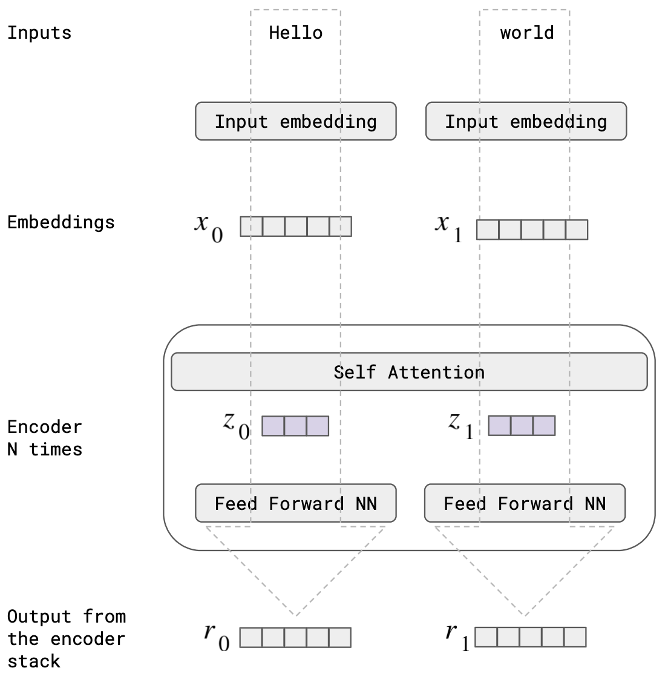
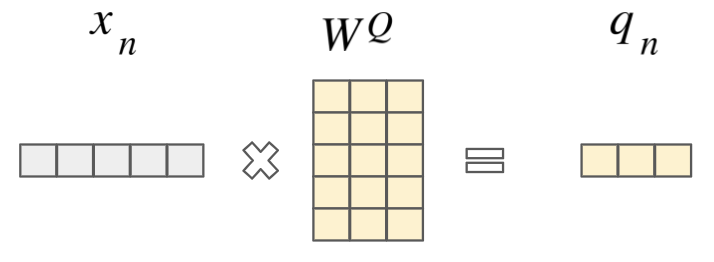
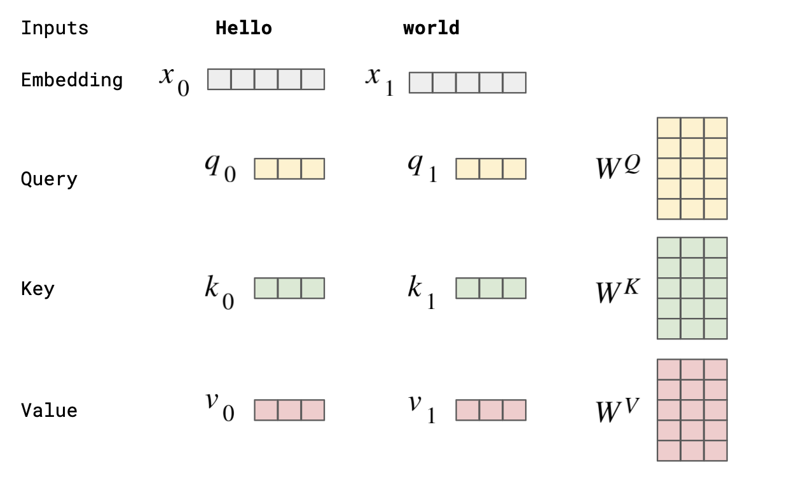
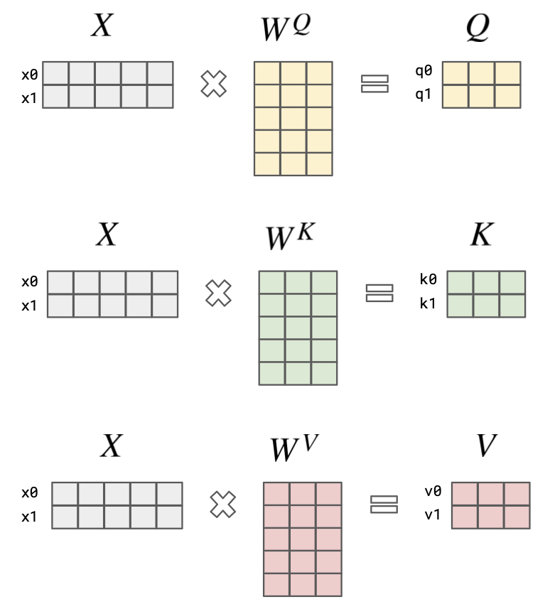
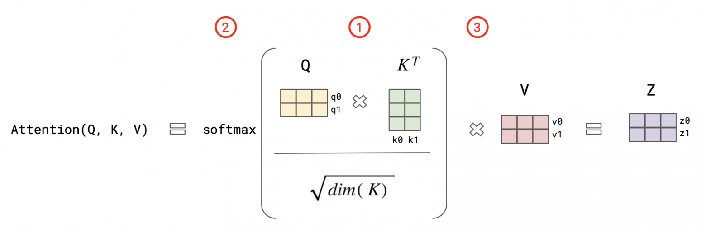
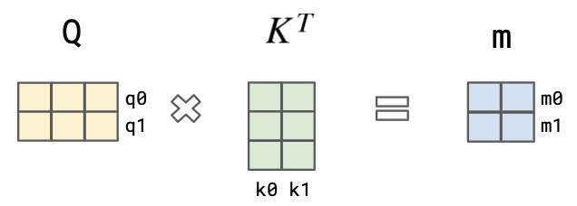
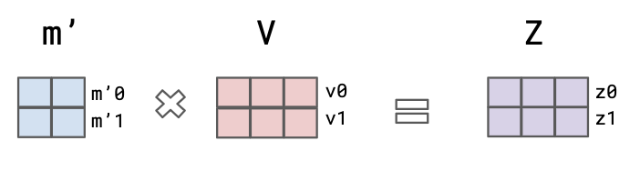

# Construyendo un modelo similar al GPT desde cero con teoría detallada e implementación de código

## La era de los Transformadores

Los Transformadores están revolucionando el mundo de la inteligencia artificial. Esta poderosa arquitectura de red neuronal, introducida en 2017, se ha convertido rápidamente en la opción preferida para el procesamiento del lenguaje natural, la inteligencia artificial generativa y más. Con la ayuda de los transformadores, hemos visto la creación de productos de inteligencia artificial de vanguardia como BERT, GPT-x, DALL-E y AlphaFold, que están cambiando la forma en que interactuamos con el lenguaje y resolvemos problemas complejos como el plegamiento de proteínas. Y las posibilidades emocionantes no terminan ahí: los transformadores también están causando revuelo en el campo de la visión por computadora con el advenimiento de los Vision Transformers.

Antes de los Transformadores, el mundo de la IA estaba dominado por las redes neuronales convolucionales para la visión por computadora (VGGNet, AlexNet), las redes neuronales recurrentes para el procesamiento del lenguaje natural y problemas de secuenciación (LSTMs, GRUs) y las redes generativas adversarias (GANs) para la IA generativa. En 2017, las CNN y las RNN representaban el 10,2% y el 29,4%, respectivamente, de los documentos publicados sobre reconocimiento de patrones. Pero ya en 2021, los investigadores de Stanford llamaron a los transformadores "modelos fundamentales" porque los ven impulsando un cambio de paradigma en la IA.

Los Transformadores combinan algunos de los beneficios que tradicionalmente se ven en las redes neuronales convolucionales (CNN) y recurrentes (RNN).

Un beneficio que los Transformadores comparten con las CNN es la capacidad de procesar la entrada de manera jerárquica, con cada capa del modelo aprendiendo características cada vez más complejas. Esto permite que los Transformadores aprendan representaciones altamente estructuradas de los datos de entrada, similares a cómo las CNN aprenden representaciones estructuradas de imágenes.

Otro beneficio que los Transformadores comparten con las RNN es la capacidad de capturar dependencias entre elementos en una secuencia. A diferencia de las CNN, que procesan la entrada en una ventana de longitud fija, los Transformadores utilizan mecanismos de autoatención que permiten al modelo relacionar directamente diferentes elementos de entrada entre sí, independientemente de su distancia en la secuencia. Esto permite que los Transformadores capturen dependencias de largo alcance entre los elementos de entrada, lo que es particularmente importante para tareas como el procesamiento del lenguaje natural, donde es necesario considerar el contexto de una palabra para comprenderla con precisión.

Andrej Karpathy ha resumido el poder de los Transformadores como una computadora diferenciable general de propósito. Es muy poderoso en un pase hacia adelante, porque puede expresar una computación muy general. Los nodos almacenan vectores y estos nodos se miran entre sí y pueden ver lo que es importante para su cálculo en los otros nodos. En el paso hacia atrás es optimizable con las conexiones residuales, la normalización de capa y la atención softmax. Por lo tanto, se puede optimizar utilizando métodos de primer orden como el descenso de gradiente. Y por último, se puede ejecutar eficientemente en hardware moderno (GPUs), que prefiere mucho paralelismo.

El Transformador es una magnífica arquitectura de red neuronal porque es una computadora diferenciable de propósito general. es simultáneamente:

1. expresivo (en el pase hacia adelante)
2. optimizable (mediante retropropagación + descenso de gradiente)
3. eficiente (gráfico de cómputo de alto paralelismo)

Sorprendentemente, la arquitectura de Transformer es muy resistente con el tiempo. El Transformer que salió en 2017 es básicamente el mismo que el actual, excepto que reorganizas algunas de las normalizaciones de las capas. Los investigadores están haciendo que los conjuntos de datos de entrenamiento sean mucho más grandes, la evaluación mucho más grande, pero mantienen la arquitectura intacta, lo cual es notable.

## Attention is all you need

La nueva arquitectura se propuso en el artículo Attention Is All You Need, publicado en 2017. El artículo describía un nuevo tipo de arquitectura de red neuronal llamada Transformador, que se basa en mecanismos de autoatención a diferencia de las redes neuronales convolucionales o recurrentes tradicionales.

El artículo original describe una arquitectura de codificador-decodificador (encoder-decoder) para que Transformer resuelva el problema de la traducción.

En este artículo, sin embargo, nos centraremos en la arquitectura de solo decodificador (decoder), ya que construiremos un modelo similar a GPT, es decir, estamos resolviendo una tarea de completar oraciones en lugar de una tarea de traducción descrita en el documento.

Para la tarea de traducción, primero debe codificar el texto de entrada y tener una capa de atención-cruzada (cross-attention layer) con el texto traducido. En la finalización de oraciones solo es necesaria la parte del decodificador, así que centrémonos en ella.

## Encoder-decorder stack

Para empezar, recordemos la arquitectura codificador-decodificador (encoder-decoder). Los modelos de lenguaje podrían clasificarse aproximadamente en solo Encoder (BERT): solo tienen los bloques Encoders, solo Decoders (GPT-x, PaLM, OPT), solo los bloques decodificadores y Encoder-Decoder (BART, T0/T5). Esencialmente, la diferencia se reduce a la tarea que está tratando de resolver:

1. Las arquitecturas de solo Encoder (como BERT) resuelven la tarea de predecir la palabra enmascarada en una oración (masked word in a sentence). Entonces la atención puede ver todas las palabras antes y después de esta palabra enmascarada. Esto tiene un término "modelado de lenguaje enmascarado" ("masked language modelling"). La arquitectura del Encoder generalmente se usa para tareas de modelado de lenguaje que involucran Encoding de una secuencia de tokens de entrada y la producción de una representación de longitud fija (fixed-length), también conocida como Context Vector o [Embedding](#intro-a-embeddings), que resume la entrada. Este vector de contexto puede ser utilizado por una tarea posterior, como la traducción automática o el resumen de texto. El modelo BERT es un buen ejemplo.
2. Para las arquitecturas de Decoder y Encoder-Decoder, la tarea es predecir el siguiente token o conjunto de tokens, es decir, los tokens dados [0, ..., n-1] predicen n. Estas arquitecturas se utilizan para tareas de modelado de lenguaje que implican generar una secuencia de tokens de salida basados en un vector de contexto de entrada (input context vector).

En el artículo Attention is all you need, el Encoder y el Decoder están representados por seis capas (el número puede ser cualquiera, por ejemplo, en BERT hay 24 bloques Encoders).

Cada Encoder consta de dos capas: Self-Atention y Feed Forward Neural Network. Los datos de entrada del Encoder pasan primero por la capa de Self-Atention. Esta capa ayuda al Encoder a buscar otras palabras en la oración de entrada cuando codifica una palabra en particular. Los resultados de esta capa se envían a la capa completamente conectada (red neuronal de alimentación directa (Feed Forward Neural Network)).

A medida que el modelo procesa cada token (cada palabra en la secuencia de entrada), la capa de Self-Attention le permite buscar pistas en los otros tokens en la secuencia de entrada que pueden ayudar a mejorar la Encoding de esa palabra. En la capa totalmente conectada, la red neuronal de alimentación directa (Feed Forward Neural Network) no interactúa con otras palabras y, por lo tanto, se pueden ejecutar varias cadenas en paralelo a medida que pasan por esta capa. Esta es una de las principales características de Transformers, que les permite procesar todas las palabras del texto de entrada en paralelo.



### <a name="intro-a-embeddings"></a>Breve introducción a los Embeddings (incrustaciones)

Una matriz de Embeddings en Python es simplemente una tabla de números que representa las palabras de entrada en un modelo de lenguaje natural. Cada fila de la matriz representa una palabra diferente y cada columna representa una dimensión de características diferentes.

Por ejemplo, si tenemos las palabras de entrada "hello" y "world", y queremos crear una matriz de embeddings con dos dimensiones de características, la matriz podría verse así:

```
    | dim1 | dim2 |
-------------------
hello| 0.2  | 0.1  |
-------------------
world| 0.3  | 0.5  |
```

En esta matriz, la fila "hello" representa el vector de embedding para la palabra "hello", y contiene dos valores que representan las dos dimensiones de características/features (en este caso, 0.2 y 0.1). De manera similar, la fila "world" representa el vector de embedding para la palabra "world", y contiene dos valores que representan las dos dimensiones de características/features (en este caso, 0.3 y 0.5).

Una analogía para entender mejor las matrices de embeddings podría ser pensar en ellas como una tabla de coordenadas que representa la ubicación de cada palabra en un espacio de características/features. Cada palabra se representa como un punto en este espacio de características/features y las coordenadas de cada punto se corresponden con los valores de su vector de embedding en cada dimensión de características/features.

Las características (o features) son las diferentes propiedades o aspectos de una palabra que se utilizan para representarla en un modelo de lenguaje natural. En el ejemplo anterior de la matriz de embeddings para las palabras "hello" y "world", las características o features podrían ser cualquier cosa que se utilice para representar estas palabras, como por ejemplo la longitud de la palabra, el número de vocales, la frecuencia con la que aparece en un corpus de texto, entre otros.

Por ejemplo, si utilizamos la longitud de la palabra y la frecuencia con la que aparece en un corpus de texto como nuestras características, la matriz de embeddings para las palabras "hello" y "world" podría verse así:

```
    | Longitud | Frecuencia |
-----------------------------
hello|    5    |   0.002    |
-----------------------------
world|    5    |   0.003    |
```

En esta matriz, la columna "Longitud" representa la longitud de cada palabra, mientras que la columna "Frecuencia" representa la frecuencia con la que cada palabra aparece en un corpus de texto. Los valores en cada celda representan la longitud o la frecuencia de cada palabra, normalizados o escalados de alguna manera para ser utilizados como features en el modelo.

Estas características se utilizan para representar cada palabra de entrada como un vector de números, es decir, como un punto en un espacio de características. En este caso, el vector de embedding para la palabra "hello" podría ser `(5, 0.002)`, mientras que el vector de embedding para la palabra "world" podría ser `(5, 0.003)`. Estos vectores de embeddings se utilizan como entrada para el modelo de lenguaje natural y se procesan para generar la salida deseada, como la predicción de la siguiente palabra en una oración o la clasificación de un texto.

Para crear embeddings utilizando "hello world" como input word en un modelo Transformer, podemos utilizar diversas librerías de procesamiento de lenguaje natural en Python, como por ejemplo spaCy, TensorFlow, PyTorch, Gensim, etc.

A continuación, te mostraré un ejemplo utilizando la librería spaCy para crear embeddings de las palabras "hello" y "world":

```python
import spacy

# Cargamos el modelo de lenguaje de spaCy en inglés
nlp = spacy.load('en_core_web_sm')

# Definimos las palabras de entrada
input_words = ['hello', 'world']

# Creamos un arreglo de vectores de embeddings para cada palabra de entrada
embeddings = []

# Generamos los embeddings para cada palabra utilizando el modelo de spaCy
for word in input_words:
    embedding = nlp(word).vector
    embeddings.append(embedding)

# Mostramos los embeddings generados para cada palabra de entrada
print(embeddings)


# El resultado de este código sería un arreglo de vectores de embeddings de dos elementos, cada uno con una longitud de 300 (que es la dimensión de características utilizada por el modelo de spaCy en inglés):
[array([-1.8676002 ,  0.74291   , ...,  1.2458001 , -0.30633   ],
      dtype=float32),
 array([ 0.16164 ,  0.22146 , ..., -0.047529, -0.16768 ],
      dtype=float32)]
```

## Algunas palabras más sobre la atención

De hecho, calculamos las "atenciones" inconscientemente mientras hablamos. Te preocupas constantemente por lo que se refiere "ella", "eso", "el" o "eso". Imagina una frase "Nunca he estado en la Antártida, pero eso está en mi lista de deseos". Sabemos que "eso" se refiere a "Antártida".

Los autores del artículo Attention Is All You Need introducen un concepto de vectores Consulta/Clave/Valor (Query/Key/Value vectors). Una buena analogía es un sistema de recuperación. Por ejemplo, cuando busca videos en Youtube, el motor de búsqueda mapeará su Consulta/Query (texto en la barra de búsqueda) contra un conjunto de Claves/Keys (título del video, descripción, etc.) asociadas con los videos en su base de datos, y le dará un resultado con los mejores videos coincidentes (Valores/Values).

En nuestro ejemplo, digamos que queremos calcular la autoatención (Self-Atenttion) de la palabra "eso" en la oración "Nunca he estado en la Antártida, pero eso está en mi lista de deseos". El proceso involucraría la creación de matrices Q, K y V para la oración de entrada, donde q (fila en la matriz Q) representa el vector de consulta (Q) para la palabra "eso", K representa la matriz clave (key matrix) para todas las palabras en la oración y V representa la matriz de valores (value matrix) para todas las palabras de la oración.

La autoatención (self-attention) para "eso" se calcularía entonces como el producto escalar de Q y K, dividido por la raíz cuadrada de la longitud de K, seguido de un producto escalar con V. Esto daría como resultado una suma ponderada de los valores en V, con los pesos determinados por la relevancia de cada palabra en la oración para la consulta "eso". En este caso, la autoatención por "eso" probablemente sería mayor por la palabra "Antártida", ya que están relacionados.

Este es el cálculo básico para la operación de autoatención en los modelos Transformer.

$softmax(\frac{QK^T}{\sqrt{d_k}})V = \sum_{i=1}^{n} softmax(\frac{qk_i^T}{\sqrt{d_k}})v_i$

Donde:

- Q: Matriz de consulta (misma que K y V en la autoatención)
- K: Matriz de clave (misma que Q y V en la autoatención)
- V: Matriz de valor (misma que Q y K en la autoatención)
- $d_k$: dimensión de K
- $softmax$: función de softmax que normaliza los pesos en la multiplicación de matrices en un rango de 0 a 1, de tal forma que la suma de todos los valores normalizados sea igual a 1. Esto asegura que los valores normalizados puedan utilizarse como pesos de atención en la operación de atención, ya que los pesos deben sumar 1 para que la suma ponderada de los valores de la matriz de valor V tenga sentido.

  $softmax(z_i) = \frac{e^{z_i}}{\sum_{j=1}^n e^{z_j}}$ / Donde $z_i$: Valor en el vector de entrada que se está normalizando y $n$: Longitud del vector de entrada

- $qk_i$: producto de punto entre la consulta Q y la clave K para la palabra i
- $v_i$: valor correspondiente a la palabra i en la matriz de valor V
- $n$: longitud de la oración
- T: en la expresión matemática K^T, la letra T indica la operación de transposición de la matriz K. La transposición de una matriz consiste en intercambiar las filas y las columnas de la matriz, es decir, si K es una matriz de tamaño (m x n), entonces la transpuesta de K, denotada por K^T, es una matriz de tamaño (n x m), donde los elementos de la columna i de K se convierten en los elementos de la fila i de K^T. Por lo tanto, en la operación QK^T, Q es una matriz de tamaño (n x d) y K es una matriz de tamaño (m x d), donde d es la dimensión de los vectores de entrada. Después de la transposición, K^T se convierte en una matriz de tamaño (d x m), lo que permite realizar la operación de producto de punto (o producto escalar/vectorial) entre Q y K^T para obtener una matriz de tamaño (n x m) que contiene la similitud entre las consultas en Q y las claves en K.

En codigo utilizando PyTorch:

```python
import torch
import torch.nn as nn
import torch.nn.functional as F

# Definimos la oración de entrada
input_sentence = "Nunca he estado en la Antártida, pero eso está en mi lista de deseos"

# Convertimos la oración en una lista de palabras
input_words = input_sentence.split()

# Definimos la dimensión de los vectores de entrada
d = 128

# Creamos una instancia de nn.Embedding para generar los vectores de embedding
embedding = nn.Embedding(len(input_words), d)

# Generamos los vectores de embedding para cada palabra de entrada
input_vectors = embedding(torch.LongTensor(range(len(input_words))))

# Definimos las matrices de consulta, clave y valor
Q = input_vectors
K = input_vectors
V = input_vectors

# Calculamos la atención utilizando softmax
scores = torch.matmul(Q, K.t()) / torch.sqrt(torch.tensor(d))
attention_weights = F.softmax(scores, dim=1)
output_vectors = torch.matmul(attention_weights, V)

# Mostramos el resultado de la operación de atención
print(output_vectors)
tensor([[-0.9265,  1.0233, -0.2897,  ...,  0.2196,  1.6644, -0.6473],
        [ 1.0860,  0.2047, -0.3145,  ..., -0.5502, -0.6240, -0.4559],
        [-1.2225, -1.3630,  0.3759,  ..., -0.7909,  0.3532,  1.1266],
        ...,
        [ 0.1062,  1.1196, -1.0840,  ..., -0.1806, -0.1345, -1.3477],
        [-0.7551,  0.5022,  0.3807,  ..., -0.2712, -0.2242,  0.4842],
        [ 0.6968,  0.2501, -0.8668,  ..., -0.5559, -0.0033, -1.7683]],
       grad_fn=<MmBackward0>)
```

En codigo, con TensorFlow:

```python
import tensorflow as tf

# Definimos la oración de entrada
input_sentence = "Nunca he estado en la Antártida, pero eso está en mi lista de deseos"

# Convertimos la oración en una lista de palabras
input_words = input_sentence.split()

# Definimos la dimensión de los vectores de entrada
d = 128

# Creamos una instancia de tf.keras.layers.Embedding para generar los vectores de embedding
embedding = tf.keras.layers.Embedding(len(input_words), d)

# Generamos los vectores de embedding para cada palabra de entrada
input_vectors = embedding(tf.range(len(input_words)))

# Definimos las matrices de consulta, clave y valor
Q = input_vectors
K = input_vectors
V = input_vectors

# Calculamos la atención utilizando softmax
scores = tf.matmul(Q, K, transpose_b=True) / tf.math.sqrt(tf.constant(d, dtype=tf.float32))
attention_weights = tf.nn.softmax(scores, axis=1)
output_vectors = tf.matmul(attention_weights, V)

# Mostramos el resultado de la operación de atención
print(output_vectors)
tf.Tensor(
[[ 0.0033139   0.00507426  0.00547205 ...  0.00202452 -0.01837145
  -0.003456  ]
 [ 0.00333045  0.005109    0.00544784 ...  0.00200186 -0.01841413
  -0.00350031]
 [ 0.0033486   0.00509828  0.00545489 ...  0.00204012 -0.01839903
  -0.00349796]
 ...
 [ 0.00333579  0.0051146   0.00548671 ...  0.00202211 -0.01841822
  -0.00345222]
 [ 0.00336279  0.00509567  0.0054412  ...  0.00204145 -0.01842242
  -0.00347955]
 [ 0.00331269  0.00505507  0.00544502 ...  0.00203352 -0.01842565
  -0.00350634]], shape=(14, 128), dtype=float32)
```

## Como Query (Q), Key (K) and Value (V) vectors son generados?

Una respuesta simple es mediante la multiplicación de vector a matriz con tres matrices diferentes ($W^Q, W^K, W^V$).

La transformación se realiza mediante la multiplicación matricial de cada una de las matrices de entrada con sus correspondientes matrices de pesos, lo que da como resultado nuevas matrices de consulta $Q'$, clave $K'$ y valor $V'$ que se utilizan para calcular los pesos de atención.

La fórmula matemática para la transformación de las matrices de entrada es la siguiente:

$Q' = QW^Q$

$K' = KW^K$

$V' = VW^V$

Donde:

- $Q, K, V$: son las matrices de entrada
- $W^Q$, $W^K$, $W^V$: son las matrices de pesos
- $Q'$, $K'$, $V'$: son las matrices transformadas

El vector $X_{n}$ en este caso sería una palabra incrustada del token de entrada (o salida de la capa de atención anterior). Las matrices $W^Q, W^K, W^V$ son inicialmente matrices de peso inicializadas aleatoriamente. Su tarea es remodelar el vector de entrada en una forma más pequeña que represente los vectores de Query, Key y Value ($q, k, v$).



Volvamos a un prompt más breve "Hola mundo" y veamos cómo lo procesará la arquitectura de Transformer. Tenemos dos palabras de entrada incrustadas (embedded input words): $x_{0}$ como Embedding (vector de contexto) de "Hola" y $x_{1}$ como Embedding de "mundo".

Y tenemos vectores ($q, k, v$) para cada una de estas dos palabras, es decir: ($q_{0}, k_{0}, v_{0}$) y ($q_{1}, k_{1}, v_{1}$). Estos vectores se generan multiplicando el vector de Embedding de la palabra y la matriz de peso $W$. Lo que se puede representar como:

$q_{0} = x_{0}W^{Q}$, $k_{0} = x_{0}W^{K}$, $v_{0} = x_{0}W^{V}$

$q_{1} = x_{1}W^{Q}$, $k_{1} = x_{1}W^{K}$, $v_{1} = x_{1}W^{V}$

Donde:

- $x_{0}$ y $x_{1}$ son los vectores de embedding para las palabras "Hola" y "mundo", respectivamente.
- $W^{Q}$, $W^{K}$ y $W^{V}$ son las matrices de pesos para la generación de los vectores de consulta, clave y valor.

Los vectores de consulta y clave (Query y Key) se utilizan para calcular los pesos de atención entre las dos palabras, mientras que los vectores de valor (Value) se utilizan para calcular la representación final de la entrada.



## Misma lógica pero en forma de matriz

Podemos presentar los mismos vectores de Query, Key y Value ($q, k, v$) en forma de matriz para todos los tokens de entrada (palabras) a la vez. Y ese es el poder de la arquitectura Transformer: podemos procesar todas las palabras de entrada a la vez.

$X[N × d_{model}]$ - es una matriz de Embeddings para las palabras de entrada (en nuestro caso, embeddings de las dos palabras "Hola" y "mundo").

$W[d_{model} × d_{k}]$ - matrices de peso inicializadas aleatoriamente.

$Q[N × d_{q}]$ - la matriz de Query vectors.

$K[N × d_{k}]$ - la matriz de Key vectors.

$V[N × d_{v}]$ - la matriz de Value vectors.

$N$ - número de tokens en una secuencia de entrada (input sequence).

$d_{v}$ - dimensión de los vectores de valor (Value).

$d_{k}$ = $d_{q}$ - dimensión de los vectores de consulta (Query) y clave (Key).

$d_{model}$ - dimensión de las hidden layers o de las dimensiones de los token embeddings.

$h$ = número de cabezas de multi-atención (number of heads of multi-head attention)

$Q = XW^{Q}$, $K = XW^{K}$, $V = XW^{V}$ - la transformación de las matrices de entrada.

Para la imagen 4, $x0$ es el vector de embedding para la palabra "Hola", $x1$ es el vector de embedding para la palabra "mundo".

En el articulo el $d_{model} = 512$ (en nuestra imagen 4 - 5 cuadrados), $d_{k}$ = $d_{q}$ = $d_{v}$ = $d_{model}$/h = 64 (3 cuadrados).



## Ahora calculemos la matriz de Atención

Una vez que obtengamos nuestras matrices $Q$, $K$ y $V$, ahora podemos calcular la matriz para las puntuaciones de atención. La puntuación determina cuánto enfoque aplicamos en otras partes de la oración de entrada a medida que codificamos una palabra en una posición determinada.



La fórmula matemática para calcular la matriz de atención es la siguiente:

$A_(Q, K, V) = softmax(\frac{QK^T}{\sqrt{d_{k}}})V = Z$

Donde:

- $Q$, $K$ y $V$ son matrices de consulta, clave y valor, respectivamente.
- $d_k$ es la dimensión de la matriz de clave $K$.
- $softmax$ es la función de normalización utilizada para obtener los pesos de atención normalizados.
- $Z$ es la matriz resultante de la operación de atención.

### Paso por paso:



1. Primer paso: multiplicar Q y matriz clave transpuesta. Cada vector de consulta/Query ("Hola" y "mundo") es `DotProducted` (producto punto) con los vectores de palabras de cada una de las claves. Esto es similar al proceso de recuperación, cuando encuentra el video de YouTube que mejor se adapta según la consulta (Query) y las claves/Keys como el título del video, la descripción. El resultado sería una matriz $(N * N)$ donde $N$ es el tamaño de la oración de entrada (size of the input sentence), es decir, el número de tokens. En nuestro caso es $(2 * 2)$.

   Aquí $m_{0} = (q_{0} * k_{0}, q_{0} * k_{1})$ representa el vector de puntuación/score de atención de la palabra "Hola". En esencia, dice que la relevancia de la primera palabra de la oración ("Hola") para la Query "Hola" es $(q_{0} * k_{0})$ y la relevancia de la segunda palabra de la oración ("mundo") para la Query "Hola" es $(q_{0} * k_{1})$. De manera similar, $m_{1} = (q_{1} * k_{0}, q_{1} * k_{1})$ representa el vector de puntaje/score de atención de la palabra "mundo". También escalamos los valores de la matriz resultante por la raíz cuadrada del tamaño de $K$ para tener gradientes más estables.

2. Segundo paso: tome un $softmax$ en cada fila de la matriz resultante (en nuestro caso, los vectores $m_{0}$ y $m_{1}$). $Softmax$ normaliza los puntajes para que todos sean positivos y sumen 1 seguido.

3. Tercer paso - es sumar los vectores de valores ponderados. Esto produce la salida de la capa de autoatención en esta posición.



Así que tenemos nuestra matriz normalizada de pesos $m'$ del Paso 2. Luego obtenemos la autoatención como la suma ponderada de los vectores de Values. Este último paso da como resultado una única representación vectorial de palabra de salida de cada palabra de entrada.

Ahora podemos repetir esta lógica agregando un nuevo bloque de atención (attention block) al Encoder. Podemos tomar la matriz resultante $Z$ (a.k.a. "hidden vectors") y considerarla como entradas para la nueva capa de atención (attention layer), que tendrá como output resultante $Z_{1}$ con nuevos vectores de palabras propios. En el documento original, el Encoder está representado por seis bloques de este tipo, pero podría ser cualquier número (por ejemplo, en BERT hay 24 bloques Encoders).

Resumiéndolo señalando que cada token (de consulta/Query) es libre de tomar tanta información usando el mecanismo de _producto punto_ de las otras palabras (sus valores/Values), y puede prestar tanta o tan poca atención a las otras palabras como quiera al ponderar (weighting) las otras palabras con las Claves/Keys.

De manera más resumida y simple, el proceso de atención en la arquitectura Transformer consiste en tres pasos.

1. En primer lugar, se realiza una multiplicación de punto entre la matriz de consulta y la matriz de clave transpuesta para obtener una matriz de puntuaciones de atención. Esto se asemeja al proceso de recuperación en el que se encuentra el video de YouTube que mejor se ajusta a la consulta (Query) y las claves/Keys como el título del video, la descripción.
2. En segundo lugar, se aplica una función $softmax$ a cada fila de la matriz de puntuaciones para normalizar los puntajes para que todos sean positivos y sumen 1.
3. En tercer lugar, se calcula la suma ponderada de los vectores de valor utilizando los puntajes normalizados como pesos para obtener una única representación vectorial de la palabra de salida. Este proceso se repite para cada token de la oración de entrada y se puede agregar más bloques de atención al Encoder para obtener nuevas representaciones vectoriales de palabras.

- En resumen:

  - el mecanismo de atención en el modelo Transformer permite que cada palabra de una oración preste atención (enfoque) en diferentes partes de la oración para obtener una representación más rica y contextual. Cada palabra (token) tiene su propia clave y valor (que se obtienen a través de una capa de embedding), y se multiplica por una consulta (query) para obtener un puntaje de atención. Este puntaje de atención se normaliza con softmax para que los valores sumen 1 y se utiliza para ponderar los valores de las palabras (los valores originales del embedding) para obtener una representación contextualizada de cada palabra.

- En otras palabras:
  - cada palabra en una oración puede decidir cuánta atención prestar a las otras palabras en función de su relevancia para la tarea en cuestión, lo que permite una representación más detallada y rica de la oración en su conjunto.

## Implementacion Self-attention

Este método define una _head of the self-attention layer_, que se utiliza en el modelo _Transformer_.

- Primero, se definen las matrices de consulta, clave y valor (key, query y value) mediante la multiplicación lineal de las entradas y los pesos.

- A continuación, se calculan los _attention scores_ mediante el producto punto entre la matriz de consulta y la transpuesta de la matriz de clave, escalando el resultado por la raíz cuadrada de la dimensión de las claves.

- Luego, se utiliza una matriz triangular inferior para enmascarar (mask) las posiciones futuras, estableciéndolas en `-inf`.

  - En este caso, la matriz triangular es una matriz de ceros y unos llamada "_lower triangular matrix_" (matriz triangular inferior), creada con la función `torch.tril()`. La matriz resultante tiene ceros en todas las posiciones por encima de la diagonal principal y unos en las posiciones por debajo o iguales a la diagonal principal. Esta matriz se utiliza para enmascarar (mask) las posiciones futuras en la secuencia de entrada para que el modelo solo pueda atender a las posiciones anteriores durante la inferencia, evitando que el modelo haga trampa y prediga palabras que aún no debería conocer.

- Después, se aplica la función de $softmax$ a los _attention scores_ y se realiza la agregación ponderada de los valores utilizando los pesos normalizados.
- Finalmente, se devuelve la salida.

```python
class AttentionHead(nn.Module):
    """
    One head of the self-attention layer
    """

    def __init__(self, head_size, num_embed, block_size):
        super().__init__()
        self.key = nn.Linear(num_embed, head_size, bias=False)
        self.query = nn.Linear(num_embed, head_size, bias=False)
        self.value = nn.Linear(num_embed, head_size, bias=False)
        # tril es una matriz triangular inferior. No es un parámetro del modelo,
        # así que lo asignamos al módulo usando `register_buffer`
        self.register_buffer("tril", torch.tril(torch.ones(block_size, block_size)))

    def forward(self, x):
        B, T, C = x.shape
        k = self.key(x)
        q = self.query(x)
        # calcular los puntajes de atención
        # (B, T, C) @ (B, C, T) -> (B, T, T)
        # debemos transponer k para que coincida con q
        wei = q @ k.transpose(-2, -1) * C**-0.5
        # la matriz Tril (matriz triangular inferior) se utiliza para enmascarar (mask)
        # las posiciones futuras (configurandolas en -inf) para que el
        # decodificador "aprenda" a predecir las próximas palabras
        wei = wei.masked_fill(self.tril[:T, :T] == 0, float("-inf"))  # (B,T,T)
        wei = F.softmax(wei, dim=-1)  # (B,T,T)
        # agregación ponderada de los valores
        v = self.value(x)
        out = wei @ v  # (B,T,T) @ (B,T,C) ---> (B,T,C)
        return out
```

En el contexto de un modelo Transformer, se utiliza la notación `BTC` (_Batch, Timesteps, Channels_) para representar la forma en que se organizan los datos de entrada en el tensor de entrada.

En el método anterior, `B`, `T` y `C` son las dimensiones de la entrada `x`. En particular:

- _Batch_ (`B`) : `batch_size`, es decir, la cantidad de ejemplos de entrenamiento que se están procesando simultáneamente en la red neuronal. En otras palabras, se refiere al número de ejemplos de entrenamiento que se utilizan en un lote. Por ejemplo, si se tiene un lote de 32 ejemplos, `B` será igual a 32.
- _Timesteps_ (`T`): la longitud de la secuencia de entrada (length sequence input), es decir, el número de palabras o tokens en la oración. En otras palabras, se refiere a la longitud de la secuencia de entrada. Para un modelo de lenguaje natural, esto sería la longitud de la oración o el número de palabras en la entrada.
- _Channels_ (`C`): la dimensión de los vectores de características (features) de cada palabra en la oración, es decir, el número de elementos en el vector que representa a cada palabra. En otras palabras, se refiere a la dimensión de los vectores de entrada. En el caso de un modelo de lenguaje natural, esto sería la dimensión del embedding de cada palabra.

La organización de los datos en la forma `BTC` es importante porque permite que el modelo procese múltiples ejemplos en paralelo, acelerando el entrenamiento del modelo. Además, al tener una longitud de secuencia variable (`T`), se puede procesar fácilmente oraciones de diferentes tamaños.
